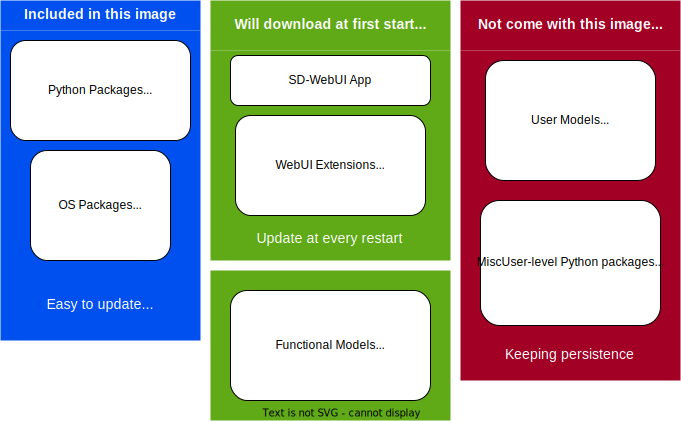

# Yet another Docker image for Stable Diffusion WebUI

image::https://github.com/YanWenKun/sd-webui-docker-base/actions/workflows/on-push.yml/badge.svg["GitHub Workflow Status"]

*link:README.zh.adoc[>> 中文文档 <<]*

This repo is inspired by https://github.com/AbdBarho/stable-diffusion-webui-docker[AbdBarho], with a different approach, and only supports https://github.com/AUTOMATIC1111/stable-diffusion-webui[AUTOMATIC1111].

## Idea

A heavy user of SD-WebUI would probably have a lot of models, extensions, and want everything up-to-date. This Docker image is how I figured out to manage them: 

Keeping the app & data in one place, and leaving the dependency in Docker.

## How it works

1. At first start, a script will download latest SD-WebUI, some extensions and essential models.
2. The whole SD-WebUI will be stored in a local folder (`./volume/stable-diffusion-webui`).
3. If you already have a SD-WebUI bundle, put it there so the start script will skip downloading.
4. At every restart of the container, a script will update SD-WebUI & its extensions.

## Prerequisites

* NVIDIA GPU with ≥6GB VRAM (for 4GB see <<q-n-a, Q & A>>).

* Latest NVIDIA GPU Drivers, Both Game and Studio version will work.

* Docker Installed
** Windows user could use https://www.docker.com/products/docker-desktop/[Docker Desktop] with WSL2 enabled.

## Usage

.A. Using `docker compose`
[source,sh]
----
git clone https://github.com/YanWenKun/sd-webui-docker-base.git

cd sd-webui-docker-base

docker compose up --detach

# Update image (only when Python components is outdated)
git pull
docker compose pull
docker compose up --detach --remove-orphans
docker image prune
----

.B. Using `docker run`
[source,sh]
----
mkdir volume

docker run -it \
  --name sd-webui \
  --gpus all \
  -p 7860:7860 \
  -v "$(pwd)"/volume:/home/runner \
  --env CLI_ARGS="--xformers --medvram --allow-code --api --enable-insecure-extension-access" \
  yanwk/sd-webui-base

# Update image (only when Python components is outdated)
docker rm sd-webui
docker pull yanwk/sd-webui-base
# Then run 'docker run' above again
----

Once the app is loaded, visit http://localhost:7860/

[[q-n-a]]
## Q & A

Q: My GPU only have 4GB VRAM +
A: Modify args in `CLI_ARGS`, change `--medvram` to `--lowvram`.

Q: Can I run it without a NVIDIA GPU? +
A: Use CPU!

1. In `docker-compose.yml`, delete `deploy:` section.
** Or in `docker run`, delete `--gpus all`.
2. In `CLI_ARGS`, change `--xformers --medvram` to 
`--use-cpu all --no-half --precision full`.

More `CLI_ARGS` available at https://github.com/AUTOMATIC1111/stable-diffusion-webui/wiki/Command-Line-Arguments-and-Settings[SD-WebUI Wiki].

Q: Why are you using latest version of dependencies? +
A: Try to squeeze more performance out of GPUs (especially PyTorch).

Q: Will upstream changes break this image? +
A: Probably will with major changes in `launch.py` & `requirements_versions.txt`, otherwise unlikely. User's data will always stay safe. User just need to update Docker image after I update this repo.

Q: Will DreamBooth be bundled? +
A: Not now. I guess not many people gonna use it. And I want to keep this repo simple and easy for people to modify. But still, there's 
link:docs/DreamBooth.adoc[A note on DreamBooth]
for anyone who want to build one.

## Some commands for debugging

.Build the image, print all logs to STDOUT.
[source,sh]
----
docker build -f Dockerfile -t yanwk/sd-webui-base --progress=plain .
----

.Run a one-time container
[source,sh]
----
docker run -it --rm --gpus all -p 7860:7860 \
  -v "$(pwd)"/volume:/home/runner \
  --env CLI_ARGS="--xformers --medvram" \
  yanwk/sd-webui-base
----

.Run into a root bash
[source,sh]
----
docker run -it --rm --gpus all \
  -v "$(pwd)"/volume:/home/runner \
  -p 7860:7860 \
  --user root \
  -e CLI_ARGS="--xformers --medvram --allow-code --api --enable-insecure-extension-access --ckpt ./test/test_files/empty.pt" \
  yanwk/sd-webui-base:latest /bin/bash
----

## License

link:LICENSE[Mulan Permissive Software License，Version 2].

It is valid in both Chinese and English, how good is that!
