# Stable Diffusion WebUI 的另一个 Docker 镜像

image::https://github.com/YanWenKun/sd-webui-docker-base/actions/workflows/on-push.yml/badge.svg["GitHub Workflow Status"]

受 https://github.com/AbdBarho/stable-diffusion-webui-docker[AbdBarho] 
启发，但是换了个思路，并且只支持 https://github.com/AUTOMATIC1111/stable-diffusion-webui[AUTOMATIC1111/stable-diffusion-webui] 。

简单来说，把复杂的依赖关系扔到容器镜像里，把沉重的软件和模型放在本地目录。

## 工作流程

1. 初次启动时，启动脚本会下载 SD-WebUI、必要的模型以及一些扩展。
2. 整个 SD-WebUI 会保存在本地 (`./storage/stable-diffusion-webui`) 。
3. 如果你已经有了现成的 SD-WebUI 包，放在上述目录，启动脚本会跳过下载。
4. 之后容器每次启动时，启动脚本会自动更新 SD-WebUI 及其扩展。

## 运行前提

* NVIDIA 显卡， ≥6GB 显存（4GB 方法见 <<q-n-a, Q & A>>）

* 安装好最新的 NVIDIA 显卡驱动，游戏驱动或 Studio 驱动均可。

* 安装好 Docker
** Windows 用户建议使用 https://www.docker.com/products/docker-desktop/[Docker Desktop] 并在安装时启用 WSL2，并 https://zhuanlan.zhihu.com/p/345645621[限制内存用量] 。
** 下载过程可能需要科学上网，在 Docker 设置中可以找到代理设置。

## 运行方法

.方法 A 使用 `docker compose`
[source,sh]
----
git clone https://github.com/YanWenKun/sd-webui-docker-base.git

cd sd-webui-docker-base

docker compose up --detach

# 更新镜像（仅在 Python 组件版本过期时需要）
git pull
docker compose pull
docker compose up --detach --remove-orphans
docker image prune
----

.方法 B 使用 `docker run`
[source,sh]
----
mkdir -p storage

docker run -it \
  --name sd-webui \
  --gpus all \
  -p 7860:7860 \
  -v "$(pwd)"/storage:/home/runner \
  --env CLI_ARGS="--xformers --medvram --allow-code --api --enable-insecure-extension-access" \
  yanwk/sd-webui-base

# 更新镜像（仅在 Python 组件版本过期时需要）
docker rm sd-webui
docker pull yanwk/sd-webui-base
# 接下来再运行一遍上述 'docker run' 即可
----

启动完成后，访问 http://localhost:7860/

## link:nightly/README.zh.adoc[不稳定最新版]

标签为 `nightly` 的 Docker 镜像：

* 频繁构建
* 安装最新的 PyTorch 与 xFormers
** （可能有免费的性能提升）
* 为 https://github.com/d8ahazard/sd_dreambooth_extension[DreamBooth 扩展] 预备好了依赖

link:nightly/README.zh.adoc[阅读 nightly 说明]

基础代码（ `latest` ）则尽量保持简单易懂、方便修改定制。

[[q-n-a]]
## Q & A

Q: 显存只有 4G 怎么办？ +
A: 把 `CLI_ARGS` 中的 `--medvram` 替换为 `--lowvram` 。

Q: 没有 NVIDIA 显卡能不能跑？ +
A: 用 CPU 跑！

1. 把 `docker-compose.yml` 中的 `deploy:` 部分去掉
** 或者把 `docker run` 中的 `--gpus all` 去掉。
2. 把 `CLI_ARGS` 中的 `--xformers --medvram` 替换为 
`--use-cpu all --no-half --precision full` 。

更多 `CLI_ARGS` 参考 https://github.com/AUTOMATIC1111/stable-diffusion-webui/wiki/Command-Line-Arguments-and-Settings[官方文档] 。

Q: 为什么要用这么新的依赖版本？ +
A: 尽可能利用新版本组件来压榨性能（尤其 PyTorch）。

Q: 上游更新会不会炸 +
A: 会，上游的 `launch.py` 和 `requirements_versions.txt` 如果修改依赖，本镜像也要跟着调整。届时用户替换镜像即可。

## 设计思路

使用 Docker 部署 SD-WebUI 面临一些挑战：

* 软件及扩展更新极快（基于 Git 更新，几乎每日都有更新），没有版本号的概念。
* 依赖库庞杂，且作者们不常更新依赖版本，意味着容器镜像会很大，且其中大部分不怎么变化。
* 程序／数据混杂，甚至还有一些模型数据存放在 `$HOME/.cache` ，意味着“容器化改造”吃力不讨好。
* 重度用户会积累大量模型文件，占用空间大且需要长期保存，未来还有可能出现新的模型类型。

但是在容器中运行 SD-WebUI 依然是有意义的：

* 把庞杂的依赖关系与用户 OS 隔离，且便于“抽换式”更新。
* 隔离程序运行环境，避免 https://huggingface.co/docs/hub/security-pickle[潜在安全风险] 。

本镜像便是基于以上观察思考，尝试在优雅与效率间取得平衡。

本思路也可以套用在其他基于 https://gradio.app/[Gradio] 开发的软件上。

## 一些方便 Debug 的命令

.构建镜像，打印所有日志（不折叠）
[source,sh]
----
docker build -f Dockerfile -t yanwk/sd-webui-base --progress=plain .
----

.运行一个一次性容器
[source,sh]
----
docker run -it --rm --gpus all -p 7860:7860 \
  -v "$(pwd)"/storage:/home/runner \
  --env CLI_ARGS="--xformers --medvram" \
  yanwk/sd-webui-base
----

.用 root 身份运行 bash
[source,sh]
----
docker run -it --rm --gpus all \
  -v "$(pwd)"/storage:/home/runner \
  -p 7860:7860 \
  --user root \
  -e CLI_ARGS="--xformers --medvram --allow-code --api --enable-insecure-extension-access --ckpt ./test/test_files/empty.pt" \
  yanwk/sd-webui-base:latest /bin/bash
----

## 声明

代码使用
link:LICENSE[木兰宽松许可证，第2版] 。
